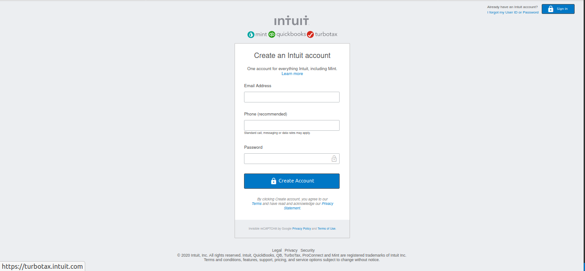

# Embedded HTML/CSS Project

### **Description:** 

Project based on Mint's sign-up page, it shows a Sign-in section on the top-right corner, a section with a Form for inputting data and related information, and a footer section.
 
 **Header (Sign-in section):**
 
 	- A link to another URL (if user forgot User ID or password).
 	- A button for Signing in.
 	
 **Form section:**
 
 	- Embedded images for the logo of the site and for three different URLs for further information.
 	- An HTML form for inputting data (Email, phone, and password).
 	- A button for creating the account.
 	- Sections with information including URLs to redirect to those websites.
 	
 **Footer section:**
 
 	- Three URLs redirecting to Legal, Privacy, and Security sites with further information.
 	- Text related to legal information about the website.
 	
	
 ### **Tools used:**
 
 HTML5, and CSS3.
 
 
 
 ### **Live Demo link:** 
 
 https://ultramax.github.io/HTML-Forms/

 
 
### **Getting Started:**

Mint's Sign-Up site, including a Header, Form, and Footer sections.

 ### **Requirements:** 
 - OS: Windows, Linux, or Mac.
 - Browser: Google Chrome, Mozilla Firefox, Edge, etc.
 

### **Set up:**

You can download the code or clone the repository to your local system.

## **Authors:**

👤 Varun Sharma

GitHub: @ultramax

LinkedIn: varun sharma

👤 Mily Morones

GitHub: @milypm

LinkedIn: mily puente

	
  
## **Show your support**

Spread the word if you like this project.

## **Acknowledgments**

Thanks to http://w3schools-fa.ir
Thanks to https://stackoverflow.com
